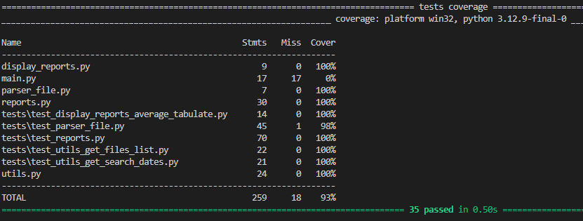

### Python script с указанием параметров для обработки файлов .log(json) с выводом результата в terminal. ###

Для запуска - склонируйте проект командой git clone https://github.com/ant4p/simple_processing_log_file_script.git   
Создайте виртуальное окружение. 
Установите в виртуальное окружение файл requirements.txt командой pip install -r requirements.txt 
Файл .env_example замените на .env c вашими данными:  
DEFAULT_DIRECTORY - для указания пути к папке, где будут находиться файлы .log для обработки.  
 
Запустите проект в корневой папке командой python main.py и укажите параметры:  
--file или -f - для указания файла или файлов  - файлы указываются через пробел, количество неограничено - обязательный параметр.  
--report или -r average - для указания отчёта на данный момент доступен только отчёт average - обязательный параметр.  
--data или -d - для указания дат -- даты указываются через пробел в формате YYYY-MM-DD - необязательный параметр.  

Итоговый вид для примера:  
python main.py -f example1.log example2.log example3.log -r average --date 2025-06-22 2025-06-23  
В данном случае будет выведен в консоль отчёт average сформированный по 3-ём файлам, данные будут отфильтрованы по 2-ум датам. 
Отчёт будет выглядеть примерно так: 

 

 
Код проекта разделён на модули:  
main.py - основной модуль проекта, содержит в себе финальную сборку всех элементов и немного логики выбора отчётов.  
parser_file.py - модуль содержащий парсер данных из аргументов,
при желании сюда добавлять дополнительные input аргументы для обработки файла  
utils.py - модуль содержит функции, которые обрабатывают аргументы полученные из парсера,
при желании сюда добавлять обработчики данных при добавлении дополнительных аргументов.  
reports.py - модуль содержащий функции формирующие отчёты, при добавлении новых отчётов -
их логика формирования прописываться будет здесь.  
display_reports.py - модуль содержащий логику приведения данных сформированных отчётов к табличному виду для вывода в консоль. 
папка test_files - с тестовыми .log файлами, которые можно использовать для проверки работоспособности скрипта  
папка tests - содержащая файлы тестирования отдельных модулей, на данный момент покрыто тестами  

 

 

Соответственно при необходимости добавить новый отчёт порядок действий будет таким:  
в файле main.py прописываем args.report == 'new_report' и функцию, которая будет формировать отчёт  
в файле reports.py создаём функцию, которая сформирует новый отчёт  
в файле display_reports.py создаём функцию, которая этот новый отчёт покажет  
в папке tests создаём новый python файл с именем "test_reports_'new_report'" и тестируем логику работы новой функции  
файлы parser_file.py и utils.py будут задействованы в том случае, если в новых отчётах будут использоваться новые input аргументы 

В проекте использованы для: 
парсера аргументов - argparse 
вывода данных - tabulate 
тестирование - pytest, pytest-cov 
